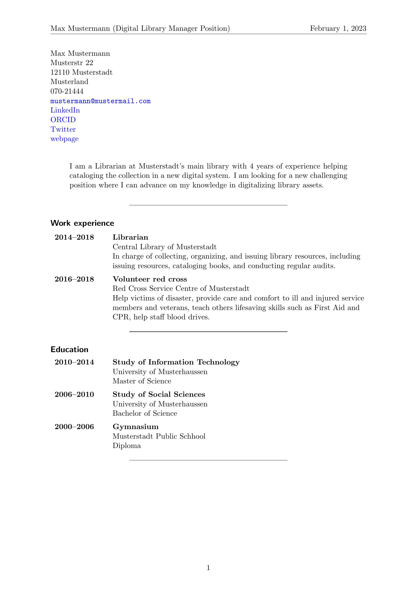
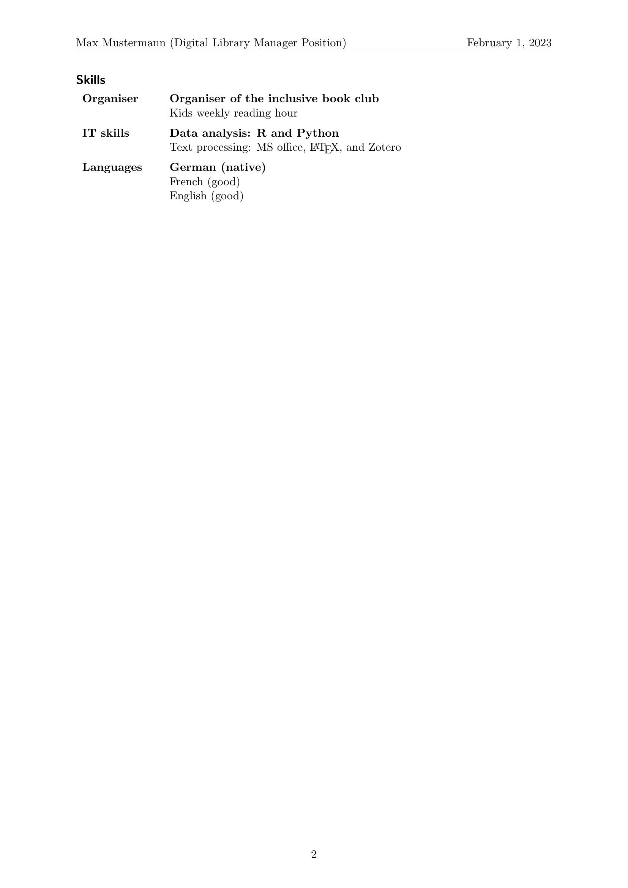

<!-- README.md is generated from README.Rmd. Please edit that file -->

# staticv

<!-- badges: start -->
<!-- badges: end -->

There exist a number of that help make appealing CVs in R. This attempt
is different in that the CV’s content and the styling is separated. The
content of a CV often incrementally changes over time. Hence, `staticv`
makes a small SQlite database to store this information about your
career, so that you can update it over time. The CV can directly be
generated from this database with the preferred styling that matches
your taste and preferences. This prevents retyping of information
over-and-over again or copy-pasting content whenever you want to reorder
and redesign the looks of your CV.

## Installation

You can install the development version of staticv like so:

``` r
# install.packages("devtools")
devtools::install_github("MartinSchobben/staticv")
```

## Example

Start with initiating your own database and adding information of your
professional actives and education.

``` r
# initiate database
init()

# education
add_education(2010, 2014, "University of Musterhaussen", "Study of Information Technology", "degree", "Master of Science", key = c("begin", "end"))
add_education(2006, 2010, "University of Musterhaussen", "Study of Social Sciences", "degree", "Bachelor of Science", key = c("begin", "end"))
add_education(2000, 2006, "Musterstadt Public Schhool", "Gymnasium", "degree", "Diploma", key = c("begin", "end"))

# experience
add_experience(2014, 2018, "Librarian", "Central Library of Musterstadt", "In charge of collecting, organizing, and issuing library resources, including issuing resources, cataloging books, and conducting regular audits.")
add_experience(2016, 2018, "Volunteer red cross", "Red Cross Service Centre of Musterstadt", "Help victims of disaster, provide care and comfort to ill and injured service members and veterans, teach others lifesaving skills such as First Aid and CPR, help staff blood drives.")

# skills
add_skills("Organiser", c("Organiser of the inclusive book club", "Kids weekly reading hour"))
add_skills("IT skills", c("Data analysis: R and Python", "Text processing: MS office, \\latex, and Zotero"))
add_skills("Languages", c("German (native)", "French (good)", "English (good)"))
```

To start a new letter you can take advantage of the staticv skeleton via
`rmarkdown::draft()` or the RStudio menu: File \> New File \> R
Markdown… \> From Template \> staticv. When finished writing your letter
the RMarkdown document can be rendered to PDF via `rmarkdown::render()`
or the RStudio Knit button.

``` r
# start a new CV using the provided skeleton
rmarkdown::draft("my_CV.Rmd", template = "staticv", package = "staticv", edit = FALSE)

# make edits to the Rmd if required

# turn Rmd into a beautiful PDF
rmarkdown::render("my_CV.Rmd")
```

 
